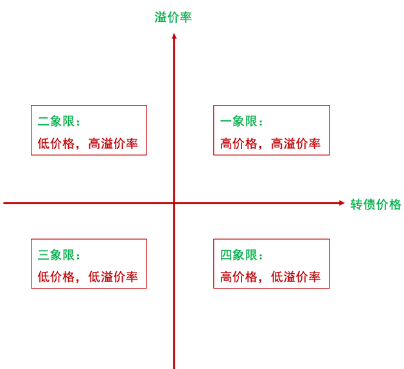

# 谈谈自己的可转债策略

在没有深入了解可转债之前, 只是迷迷糊糊了解到可转债打新, 打新中了的话, 一份就可以赚个加鸡腿钱了。 在一年多之前在一个偶然的机会看到了在一篇文章上看单纯靠可转债就可以取得这么平稳，乐观的收益，终于下定决心好好去了解可转债这个投资品种。

在看了两个可转债的入门书籍，一本是可转债魔法书，一本是阿秋可转债黄金宝典。了解到可转债的“下有保底上不封顶”特点，大部分公司到期都有不想还钱的想法，所以想尽方法让可转债价格升 130 以上，达到强赎条件，促进持债人转股，而不用还债。

回忆一下可转债的四大要素：

- 转股价 — 可转债价格的心脏，发动机，以转股价为参照点，随着正股价格的波动而波动
- 下修转股价条款 — 转机，当可转债价格跌到满足下修条件之后，公司又不想到期还钱。下修转股价之后，往往能大幅拉升可转价格
- 强制赎回条款 — 胜利的号角，当可转债价格上升满足强赎条件之后，促进持有人转股，公司就会发强赎条款，这也意味着这只可转债完成历史的使命
- 回售条款 — 保险，有了这个回售条款意味着持有人可以按照条款的价格要求公司买回它的债券，再次保证了可转债垫底价格不会太低。

基于这些要素，可转债衍生出来很多很多指标，比如熟知的“转股溢价率”，“到期收益率”，“回售收益率”，“双底”等等，再者根据这些指标制定自己的投资策略，比如低价格，低溢价还有由此衍变出来“多因子”策略，还有的下修博弈策略，结合各种策略的大杂烩的摊大饼策略，甚至有些关注套利空间的策略。

正式进入策略介绍之前，先梳理一下可转债四象限。所有的可转债都离不开它

- 一象限：高价格，高溢价率，债性弱，股性强，收益高，风险大。

- 二象限：低价格，高溢价率，债性强，股性弱，收益低，风险小，易触发「转股价下修条款」。

- 三象限：低价格，低溢价率（双低），债性强，股性强，收益高，风险小。

- 四象限：高价格，低溢价率，债性弱，容易强赎，跟正股程度高。

个人觉得既然选择了可转债品种，一定程度说明了本金安全，保险最重要，不然的话和之前去买正股区别不大。所以大部分策略也是侧重第二第三象限的可转债。

## 我的策略

在了解，跟进一些大 V 可转债策略之后，渐渐摸索一些策略选标的标准和考虑点。加上自己会计算机编程对策略的选择标的有一点辅助。所以也想魔改一些指标形成自己的标准，真正到市场上验证成果，和各位朋友交流交流想法，首先是第一个策略：

### 到期保本策略

这个策略第一就是安全保本，第二就是博弈下修，所以有如下必须条件:

- 税后到期收益率 > 0 — 到期保本
- 距离转股时间已到 — 这样正股上涨才带得动
- 转股价格/每股净资产 > 1.5 — 下修有足够空间,排除到银行之类可转债,还有净资产为负的风险较大的可转债
- 满足下修条件，且不在承诺不下修时间内 — 排除那些在截至时间内承诺不下修的可转债

此外可以根据自己的情况增加其他条件,比如

- 转债剩余/市值比例 > 10 — 还债压力大，下修动力强

### 回售摸彩策略

这个策略也是主要抓住在回售期内的被迫于回售条款,其可转债下修动力更强, 但是也要结合安全垫底的条件,所以列出如下条件:

- 回售内 — 回售期内
- 满足下修股价要求 -- 必须
- 转债剩余/市值比例 > 5 — 还债压力相比较大(可动态调节比例)，下修动力强
- 转股价格/每股净资产 > 1.5 — 下修有足够空间,排除到银行之类可转债,还有净资产为负的风险较大的可转债
- 转债价格低于 115 > 有一定的安全保底
- 满足下修条件，且不在承诺不下修时间内 — 排除那些在截至时间内承诺不下修的可转债

此外可以根据自己的情况增加其他条件,比如

- 到期时间少于半年 > 临期到期时间了,下修希望更小了
- 企业的性质 -- 如果是国资之类性质的企业到期还钱可能性更高
- 结合企业的财务状况 -- 企业的财务状况好(负债率低,盈利状况好,流动资金高),还钱可能性更高

### 低价格低溢价

- 转股溢价< 10% — 低溢价
- 转债价格低于 128 — 高于 130，股性太强,且有强赎风险,留点空间(这个自己调节)
- 距离转股时间—已到 — 正股上涨的话，可以及时跟上这股风
- 转股价格/每股净资产 > 1 — 有下修空间,进一步防止下跌后,有退路
- 不在强赎期间 - 有强赎的话,已经名牌了,不趟着趟水了

> 这个策略值得注意的是,要关注正股 K 线的走势,有些时候正股快速一波上涨之后,拉低了溢价率,导致低溢价小于<10%, 如果后续估计快速下跌之后, 又回迅速拉开溢价率,所以结合 K 线走势和可转债价格进入操作

## 操作

还是摊大饼方式，优先选择回售摸彩和低价格低溢价中较为优秀的标的，再选择到期保本中的（其实这个视个人风险而定， 我的话博弈下修，还有正股的上涨成分较高）
大概选择 10 ～ 15 支进行操作，摊大饼的策略可以借鉴孔曼子写的[《孔曼子 - 漫谈摊大饼投资策略》](https://www.jisilu.cn/question/421212)

### 复盘 Review

复盘周期个人觉得一周,两周关系不大,如果这期间没有可转债出现下修或者正股大涨大跌的话。期间可以借助条件单提醒，甚至卖出操作

上面魔改的策略, 跑过了三四个月的, 和整体可转债市场走势差不多,主要原因还是没有碰到一个下修的情况。还有就是一直在完善策略的指标

## 最后

这些都是我个人魔改出来的策略，并没有经历过市场长时间的验证，所以非常期待和大家一起交流彼此的想法，海纳百川。
